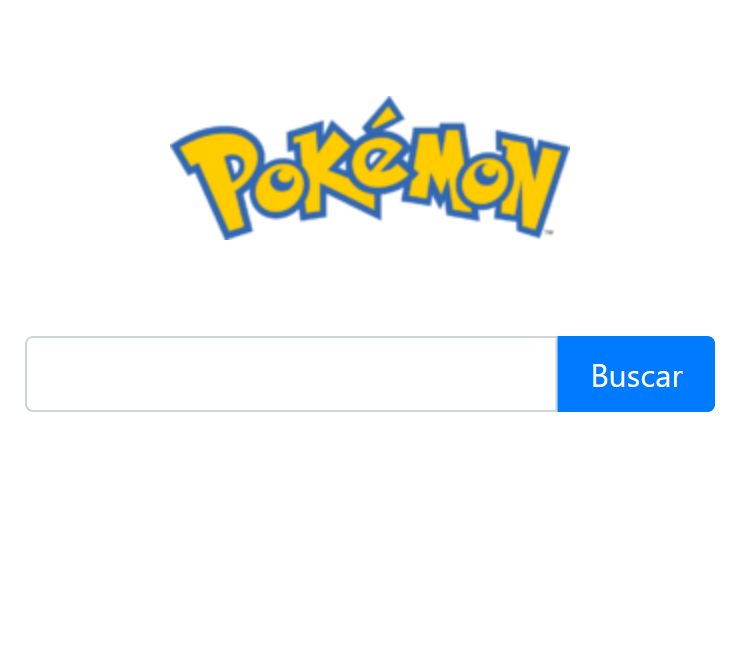

# 🔎Pokedex Search 
## Angular + RestAPI + Bootstrap

Este projeto cria um mecanismo de busca por Pokemons e exibe seus atributos.

As informações são obtidas consumindo a API: https://pokeapi.co/

Para executar o projeto navegue para o diretório `/pokedex`.  e execute o comando `ng serve` .

Mais detalhes no arquivo `/pokedex/README.md`.